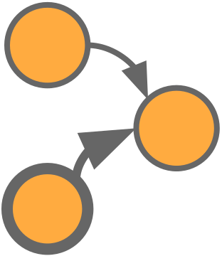

#  FPCMCI - Filtered PCMCI

Extension of the state-of-the-art causal discovery method [PCMCI](https://github.com/jakobrunge/tigramite) augmented with a feature-selection method based on Transfer Entropy. The algorithm, starting from a prefixed set of variables, identifies the correct subset of features and possible links between them which describe the observed process. Then, from the selected features and links, a causal model is built.


## Useful links

* [Documentation](https://lcastri.github.io/fpcmci/)
* [Tutorials](https://github.com/lcastri/fpcmci/tree/main/tutorials)


## Why FPCMCI?

Current state-of-the-art causal discovery approaches suffer in terms of speed and accuracy of the causal analysis when the process to be analysed is composed by a large number of features. FPCMCI is able to select the most meaningful features from a set of variables and build a causal model from such selection. To this end, the causal analysis results **faster** and **more accurate**.

In the following it is presented an example showing a comparison between causal models obtained by PCMCI and FPCMCI causal discovery algorithms on the same data. The latter have been created by defining a 6-variables system defined as follows:

``` python
min_lag = 1
max_lag = 1
np.random.seed(1)
nsample = 1500
nfeature = 6

d = np.random.random(size = (nsample, feature))
for t in range(max_lag, nsample):
  d[t, 0] += 2 * d[t-1, 1] + 3 * d[t-1, 3]
  d[t, 2] += 1.1 * d[t-1, 1]**2
  d[t, 3] += d[t-1, 3] * d[t-1, 2]
  d[t, 4] += d[t-1, 4] + d[t-1, 5] * d[t-1, 0]
```

Causal Model by PCMCI       |  Causal Model by FPCMCI 
:-------------------------:|:-------------------------:
  |  
Execution time ~ 6min 50sec | Execution time ~ 2min 45sec

The causal analysis performed by the **FPCMCI** results not only faster but also more accurate. Indeed, the causal model derived by the FPCMCI agrees with the structure of the system of equations, instead the one derived by the PCMCI presents spurious links:
* $X_2$ &rarr; $X_4$
* $X_2$ &rarr; $X_5$

Note that, since all the 6 variables were involved in the evolution of the system, the FPCMCI did not remove any of them. In the following example instead, we added a new variable in the system which is defined just by the noise component (as $X_1$ and $X_5$) and does not appear in any other equation, defined as follows: $X_6(t) = \eta_6(t)$. In the following the comparison between PCMCI and FPCMCI with this new system configuration:

Causal Model by PCMCI       |  Causal Model by FPCMCI 
:-------------------------:|:-------------------------:
  |  
Execution time ~ 8min 40sec | Execution time ~ 3min 00sec

In this case the FPCMCI removes the $X_6$ variable from the causal graph leading to generate exactly the same causal model as in the previous example, with comparable executional time. Instead, the PCMCI suffers the presence of $X_6$ in terms of time and accuracy of the causal structure. Indeed, a spurious link $X_6$ &rarr; $X_5$ appears in the causal graph derived by the PCMCI.


## Citation

If you found this useful for your work, please cite this papers:
```
@inproceedings{castri2023fpcmci,
    title={Enhancing Causal Discovery from Robot Sensor Data in Dynamic Scenarios},
    author={Castri, Luca and Mghames, Sariah and Hanheide, Marc and Bellotto, Nicola},
    booktitle={Conference on Causal Learning and Reasoning (CLeaR)},
    year={2023},
}
```


## Requirements

* tigramite>=5.1.0.3
* pandas>=1.5.2
* netgraph>=4.10.2
* networkx>=2.8.6
* ruptures>=1.1.7
* scikit_learn>=1.1.3
* torch>=1.11.0
* gpytorch>=1.4
* dcor>=0.5.3
* h5py>=3.7.0    


## Installation

Before installing the FPCMCI package, you need to install Java and the [IDTxl package](https://github.com/pwollstadt/IDTxl) used for the feature-selection process, following the guide described [here](https://github.com/pwollstadt/IDTxl/wiki/Installation-and-Requirements). Once complete, you can install the current release of `FPCMCI` with:
``` shell
pip install fpcmci
```

For a complete installation Java - IDTxl - FPCMCI, follow the following procedure.

### 1 - Java installation
Verify that you have not already installed Java:
```shell
java -version
```
if the latter returns `Command 'java' not found, ...`, you can install Java by the following commands, otherwise you can jump to IDTxl installation.
```shell
# Java
sudo apt-get update
sudo apt install default-jdk
```

Then, you need to add JAVA_HOME to the environment
```shell
sudo nano /etc/environment
JAVA_HOME="/lib/jvm/java-11-openjdk-amd64/bin/java" # Paste the JAVA_HOME assignment at the bottom of the file
source /etc/environment
```

### 2 - IDTxl installation
```shell
# IDTxl
git clone https://github.com/pwollstadt/IDTxl.git
conda create --name fpcmci python=3.8 pip matplotlib h5py scipy networkx
conda activate fpcmci
conda install -c conda-forge jpype1    # required by CPU JIDT estimators
conda install -c conda-forge pyopencl  # required by GPU OpenCL estimators
conda install -c anaconda ecos         # required by Tartu PID estimator
conda install numba                    # required by NumbaCuda estimators
conda install cudatoolkit              # required by NumbaCuda estimators
conda install mpmath

cd IDTxl
pip install -e .
```

### 3 - FPCMCI installation
```shell
pip install fpcmci
```


## Recent changes

| Version | Changes |
| :---: | ----------- |
| 4.2.1 | fixed dependency error in setup.py |
| 4.2.0 | causal model with only selected features fix<br>adapted to tigramite 5.2<br>get_causal_matrix FPCMCI method added<br>f_alpha and pcmci_alpha instead of alpha<br>requirements changed<br>tutorials adapted to new version |
| 4.1.2 | tutorials adapted to 4.1.1 and get_SCM method added in FPCMCI |
| 4.1.1 | PCMCI dependencies fix: FPCMCI causal model field added, FPCMCI.run() and .run_pcmci() outputs the selected variables and the corresponding causal model |
| 4.1.0 | FSelector and FValidator turned into FPCMCI and PCMCI<br>show_edge_label removed and dag optimized<br>new package included in the setup.py<br>added tutorials<br>new example in README.md |
| 4.0.1 | online documentation and paths fixes |
| 4.0.0 | package published |